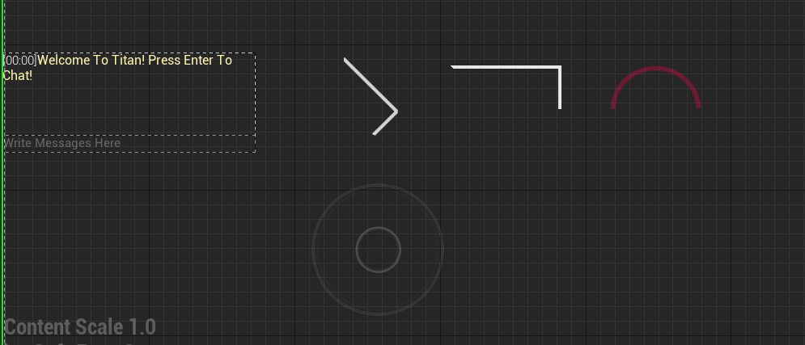
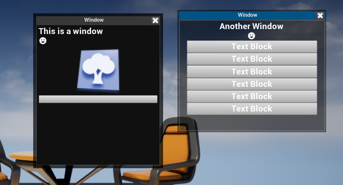

##  Additional UMG Components Plugin For UE4 (Experimental)

### OverView:




Includes:
```
- Window system (resizable, movable and self contained )
- Google font icons text box (hunderds of UI icons just copy the codepoint from https://fonts.google.com/icons and paste in font icon text block )
- Titan Button (a button with shared config to ensure a common style between all buttons in project )
- Square Progress Bar
- Diamond Progress Bar
- Radial Progrss Bar
- Chat System (Networked)
- Joystick 
- Pan And Swipe 
- Pinch Zoom And Rotate 
- Wrapped Around Unreal Default Joystick

```


[](https://youtu.be/GQbN8Res764)

---

## How To Install:
Current Target Platform UE4.26+ (UE5) .
1. Copy Plugin to your project plugins (Needs to be a c++ project ,if its not add a new c++ blank class in editor to make it work)
2. Compile 
3. Finished!

## License 


[](http://badges.mit-license.org)

**[MIT license](http://opensource.org/licenses/mit-license.php)**